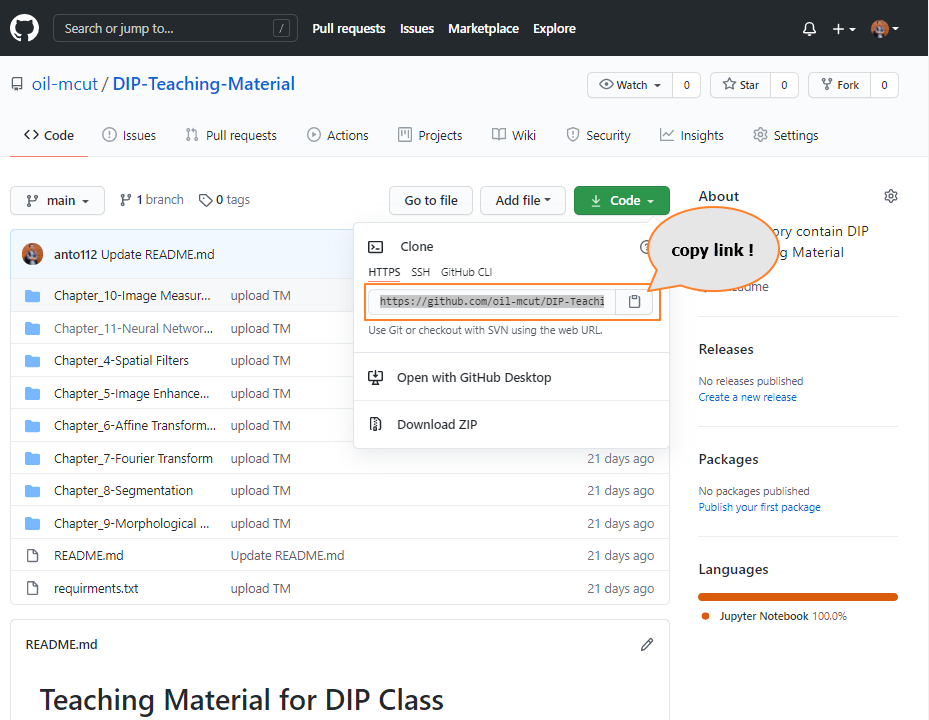
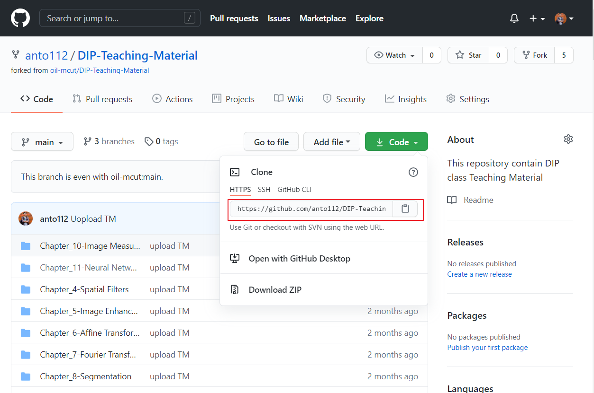
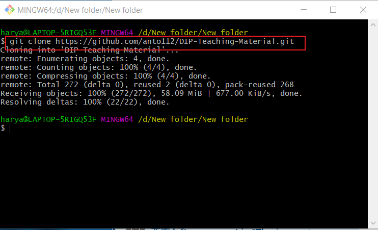
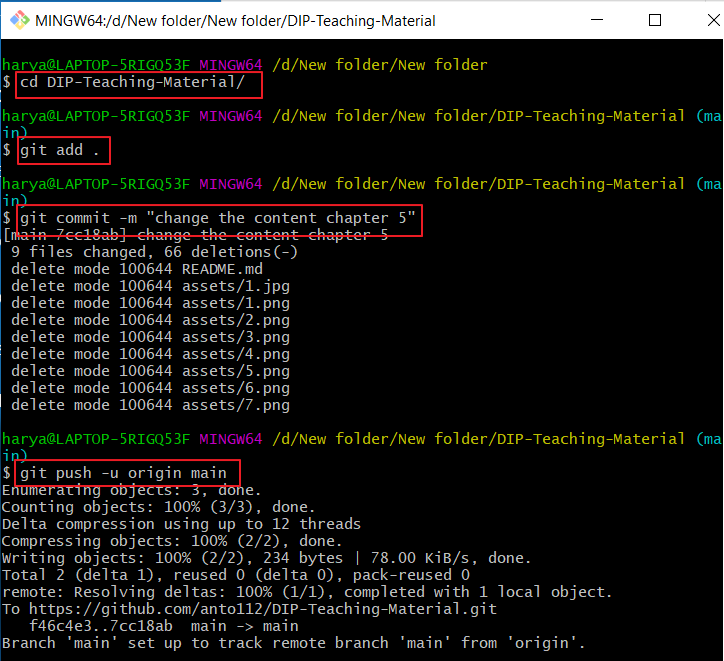
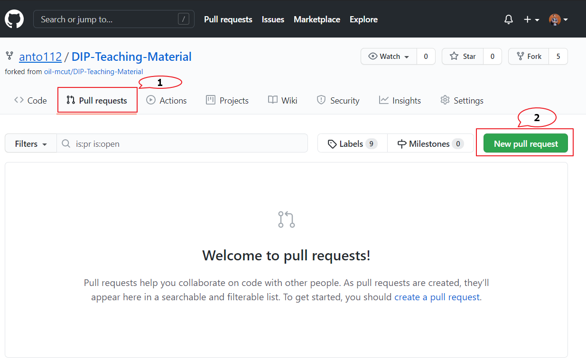
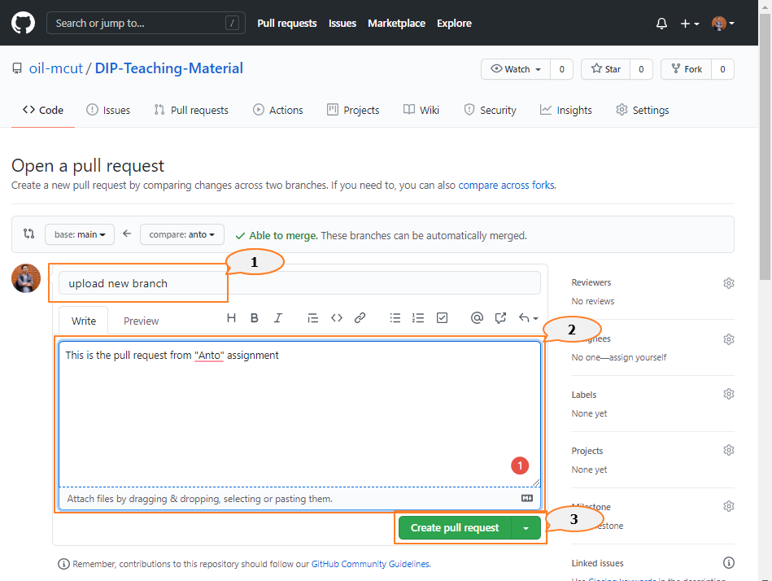
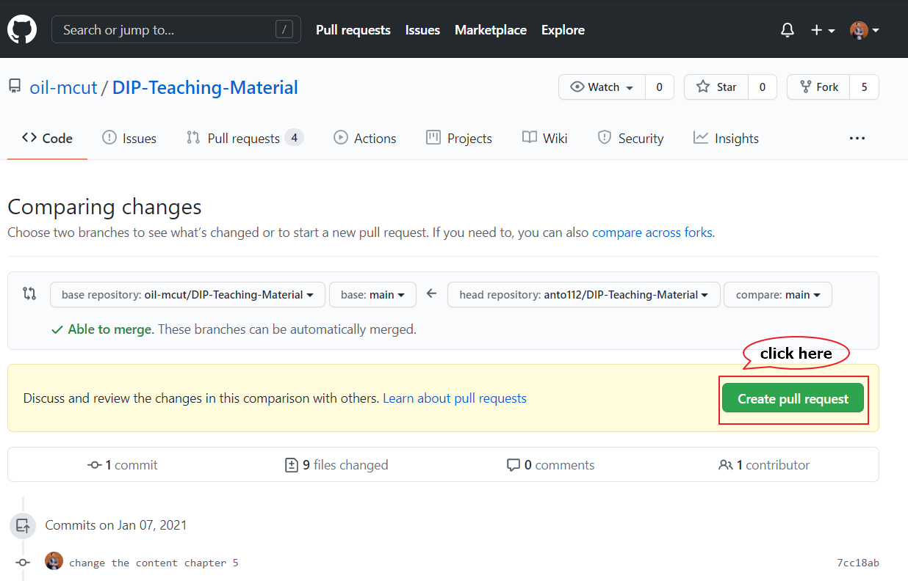
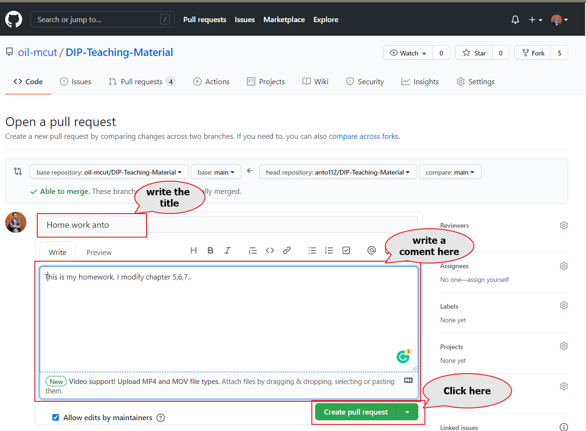
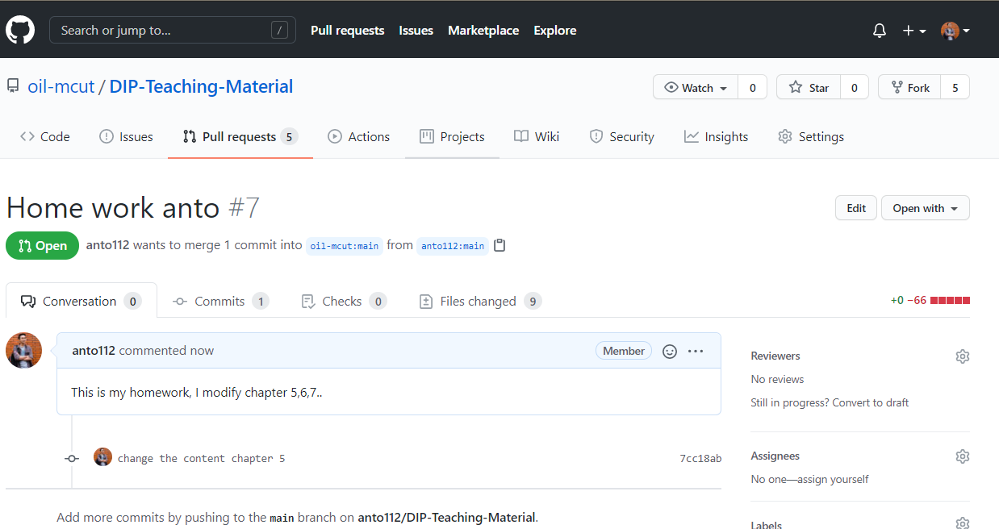

# Teaching Material for DIP Class

### 1. Running the code

1. Clone this repository

   ```
   $ git clone https://github.com/oil-mcut/DIP-Teaching-Material.git
   ```

2. Setup environment

   ```
   $ cd DIP-Teaching-Material
   $ pip3 install -r requirments.txt
   ```

3. Running Jupyter notebook

   ```
   $ jupyter notebook
   ```


### 2. Guidance to make do assignment and pull request

1. Go to the link and fork it into your GitHub account

   

2.  After you fork, clone the repository to your local computer

     

   
​	Open git bash in windows

   

3. Running the code and modify it

4. Upload your code to your repository in GitHub account

   

After success upload, then go to GitHub website and open pull request



5. Pull request

   

   create pull request

   
   
   

​		


you success make a pull request, finish...




****

***Good Luck - Anto112***

